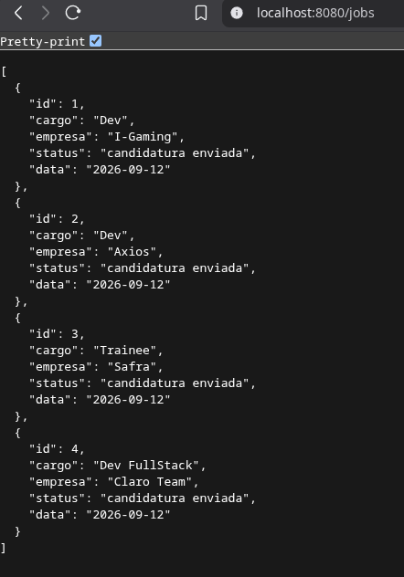

# JobTracker 


There a useful project to track jobs applications, using http/net 
package in Go.
Funcional Api rest with endpoints to create, get, delete, list and update.



## Usage
At moment, it is running in slice storage, so fork and pull the project
and run it.

```
# To insert data into api:
    -H "Content-Type: application/json"   
    -d '{"cargo": "Trainee", "empresa": "Safra",
      "status": "candidatura enviada"}'

# Delete using Id:
    curl -X DELETE http://localhost:8080/jobs/{id}

# And to list all jobs applications:
    http://localhost:8080/jobs

# Or by id:
    http://localhost:8080/jobs/{id}
```

## Contributing

Pull requests are welcome. For major changes, please open an issue first
to discuss what you would like to change.

Please make sure to update tests as appropriate.

## License

[MIT](https://choosealicense.com/licenses/mit/)