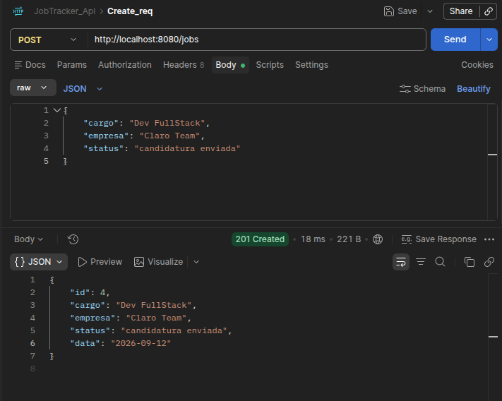
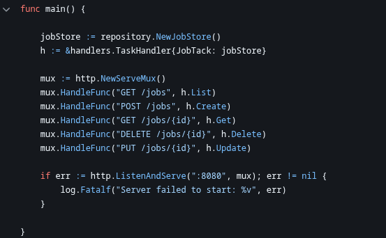
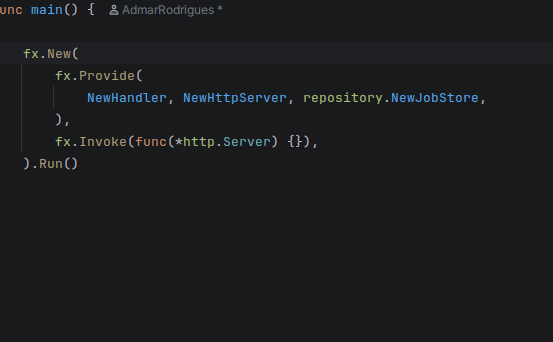
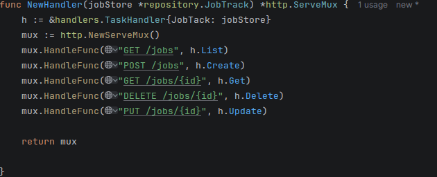
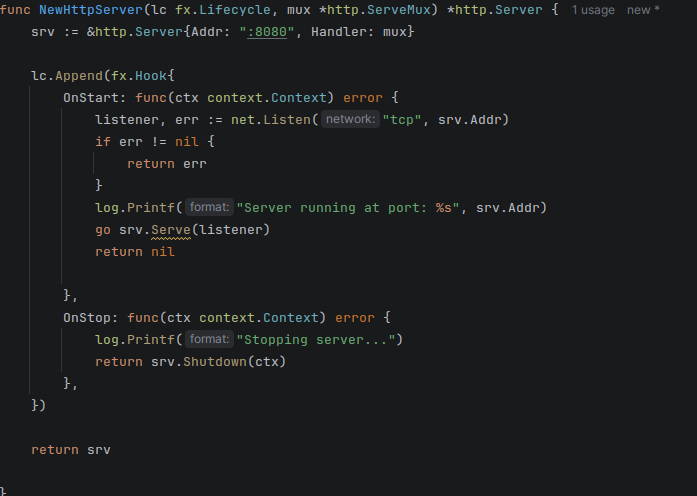
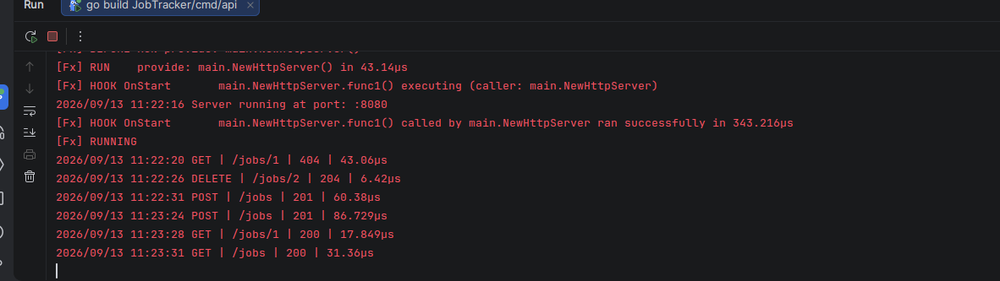
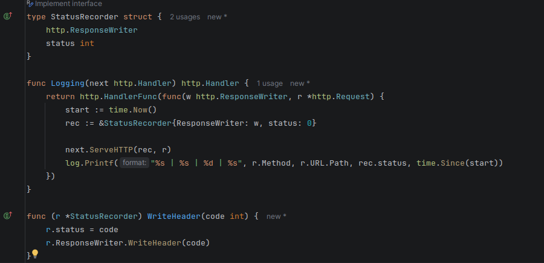

# JobTracker Go Api

 This is a tracker job API where you put the job information
and status to follow up.

### 001  only minimum
At this point the api have only creates, Get and list All
end points that returns JSON response.

### 002 Why am I using UberFx right now ?
The only reason to use this now, is pure practice !
This is not over-engineering (not in this case!).
I’ll explain how it works there !

Before we have this structure:  
When have constructor to slice storage, the struct
taskHandler that receives the repository, and mux instance.

 
Now we have this:

Simple. No ?
 - fx.New() → Start the fx application.
 - fx.Provide() → Here we put the constructors to make the dependency graphs.
 - fx.Invoke() → The fx only create object if they are explicitly necessary. In this case the invoke method forces fx to instantiate the *http.Server*, hooking up the life cycle.

this:

Basically the same as the first one, but is the ServerMux constructor receiving the repository.

And finally this:

Here we have the httpServer constructor, that receives the serverMux and fx.Lifecycle.
 - fx.LifeCycle → Consists in attach hooks, OnStart and OnStop.
    - OnStart: Run as soon as the program start.
    - OnStop: Ensure the *Graceful Shutdown* if process receives an interruption signal (Ctrl+C).

### 003 middleware logging

What is a middleware ? Is an intermadiary function that intercept an http request. There a lot of different types of middleware.  
In our case we have a logging middleware, that register the *response time, method and URL of each request*.

Middleware code:

